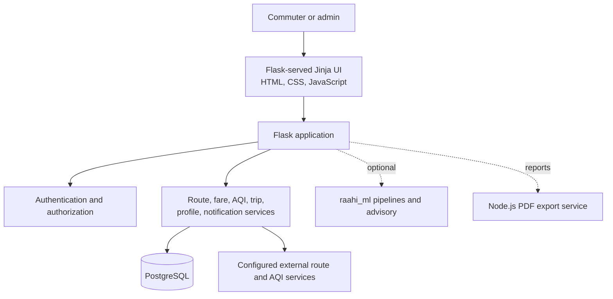

# Raahi

<p align="center">
  <strong>Smart commuting decisions for everyday travel.</strong><br>
  Route planning, fare estimation, AQI context, trip tracking, and sustainable mobility insights in one Flask application.
</p>

<p align="center">
  
  
  
  
  
  <a href="LICENSE"></a>
</p>

> This project was developed as a collaborative group project. This repository is maintained as my personal portfolio copy.

## Overview

Raahi is a web-based smart commuting assistant. It brings route, cost, air-quality, trip, and environmental context together so commuters can compare transportation choices with more than just travel time in mind.

## Problem

Daily travel decisions balance several competing factors: time, fare, convenience, pollution exposure, and environmental impact. These inputs are often spread across different services, making it difficult to compare options in one place.

## Solution

Raahi provides a single workflow for entering a destination, comparing available modes, reviewing route and AQI context, and saving completed trips for later personal and administrative insights.

## Features

- Route planning with distance and estimated travel time.
- Mode comparisons for walking, train, bus, and auto journeys where data is available.
- Fare estimation, including bus fare and depot-related lookups.
- Current AQI information with particulate readings and a quality label.
- Trip saving, history, profile information, money-saved and CO2-related insights.
- Admin dashboards for users, trips, route usage, AQI summaries, analytics, and available model metrics.
- Optional ML advisory and route-model pipelines kept in the separate `raahi_ml/` package.
- Separate Node.js/Puppeteer PDF export service for reports.

External route and AQI data availability depends on configured credentials and service responses. ML features may require local datasets or model assets.

## Architecture



The main Flask application owns the web experience, route registration, services, authentication, and database access. The ML package and PDF export service are separate supporting components so optional or heavier workloads do not need to be part of the core Flask request path.

## Tech Stack

| Area | Technologies |
| --- | --- |
| Application | Python 3.12, Flask 3.0.3, Flask-Login, Flask-SQLAlchemy |
| Data | PostgreSQL 15, psycopg2, SQLAlchemy |
| Frontend | Jinja templates, HTML, CSS, JavaScript |
| Analytics and ML | pandas, NumPy, scikit-learn, joblib, XGBoost, Folium |
| Supporting service | Node.js, Express, Puppeteer, PostgreSQL client |
| Development and deployment | Docker Compose, Gunicorn, Vercel configuration |

## Project Structure

```text
backend/
  main.py                  Flask application entry point
  routes/                  Web, auth, API, admin, and ML routes
  services/                Application and domain services
  database/                Connection, extensions, and models
  pdf_export_service/      Optional Node.js PDF report service
frontend/
  templates/               Jinja pages and reusable components
  static/                  CSS and JavaScript assets
raahi_ml/                  Optional ML pipelines and model utilities
config/                    Application configuration
scripts/                   Database and maintenance utilities
tests/                     Automated tests
```

## Installation

### Prerequisites

- Python 3.12
- PostgreSQL 15 or a compatible PostgreSQL instance
- Git
- Node.js and npm only if using the PDF export service

Clone the repository and create a virtual environment:

```bash
git clone https://github.com/yashvieeeeee/Raahi.git
cd Raahi
python -m venv .venv
```

Activate it on Windows PowerShell:

```powershell
.\.venv\Scripts\Activate.ps1
```

On macOS or Linux:

```bash
source .venv/bin/activate
```

Install Python dependencies and configure local settings:

```bash
pip install -r requirements.txt
cp .env.example .env
```

On PowerShell, use `Copy-Item .env.example .env` instead of `cp`. Update `.env` with a valid `DATABASE_URL`, `SECRET_KEY`, database credentials, and the external API values required by the features you want to run.

Start the Flask application:

```bash
python -m backend.main
```

Open `http://localhost:5000`.

Run the available tests with:

```bash
python -m pytest tests -q
```

### PDF export service

The report exporter is maintained separately under `backend/pdf_export_service/`:

```bash
cd backend/pdf_export_service
npm install
npm start
```

Configure `PDF_EXPORT_SERVICE_URL` and `PDF_SERVICE_PORT` in `.env` when connecting it to the Flask application.

## Docker

The included Compose configuration starts PostgreSQL and mounts `scripts/init.sql` for database initialization. It does not containerize the Flask application or PDF service.

```bash
docker compose up -d
docker compose logs -f postgres
docker compose down
```

Set the Flask database variables to match the Compose defaults, or provide your own values through the shell environment. The default passwords are development placeholders and must not be used in a public deployment.

## Security

- Copy `.env.example` to `.env`; never commit credentials, API keys, or production secrets.
- Replace all placeholder passwords and `SECRET_KEY` values before deployment.
- Restrict database access and use a managed secret store in hosted environments.
- Review external API quotas and keys before enabling route or AQI integrations.
- Report a suspected vulnerability privately using the process in [SECURITY.md](SECURITY.md).

## Screenshots

No screenshots are included until they are captured from a real running environment. Add the following files under `screenshots/` and place them as indicated:

| File | README placement |
| --- | --- |
| `landing-page.png` | Immediately below this section as the product overview image |
| `route-planner.png` | Features section, after the route-planning description |
| `route-results.png` | Features section, after route and fare comparison |
| `aqi-information.png` | Features section, after AQI-aware commuting |
| `user-dashboard.png` | Features section, after personal insights |
| `trip-history.png` | Features section, after trip tracking |
| `admin-dashboard.png` | Features section, after admin capabilities |

Example embed:

```markdown

```

## Team Attribution

This project was developed as a collaborative group project. This repository is maintained as my personal portfolio copy.

### My Contributions

Document only work personally completed:

- _Contribution placeholder 1_
- _Contribution placeholder 2_

### Team Members

Add the actual collaborators and profile links before publishing:

- _Team member placeholder 1_
- _Team member placeholder 2_

## Future Scope

Potential follow-up work includes live public-transport updates, more detailed emissions estimates, improved personalized recommendations, mobile clients, and longer-term commuting analytics. These are future directions, not current capabilities.

## Contributing

Read [CONTRIBUTING.md](CONTRIBUTING.md) before opening a pull request. Use the issue templates for bugs and feature proposals, and include tests or a clear explanation when tests cannot be run.

## License

Raahi is available under the [MIT License](LICENSE).

## Portfolio Review

| Area | Score | Actionable improvement |
| --- | ---: | --- |
| Documentation | 8/10 | Add verified screenshots and a short demo walkthrough. |
| Architecture presentation | 8/10 | Add a deployment diagram once the hosted topology is finalized. |
| Code organization | 8/10 | Add focused tests around route, fare, AQI, and authentication boundaries. |
| Recruiter appeal | 7/10 | Replace contribution placeholders with concrete outcomes and links. |
| Open-source readiness | 8/10 | Adopt the issue, PR, security, and conduct documents in this repository. |
| Deployment readiness | 6/10 | Document a tested production database and secret-management workflow. |

**Overall: 7.5/10.** The project has a credible product and architecture story; evidence of operation, ownership, and production deployment will create the biggest portfolio lift.

## Release Strategy

Until automated releases are added, use version tags such as `v0.1.0` for reviewed milestones. Each release should summarize user-visible changes, migration requirements, known limitations, and tested deployment targets in [CHANGELOG.md](CHANGELOG.md).
